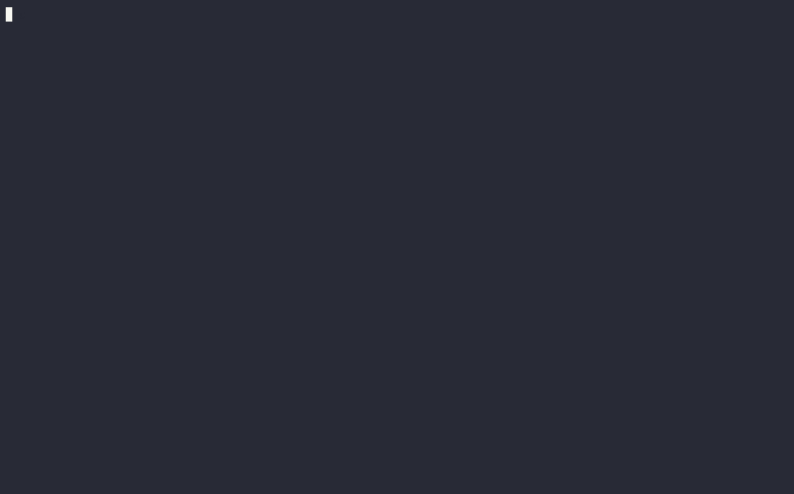

# Podlet


Podlet generates [podman](https://podman.io/) [quadlet](https://docs.podman.io/en/latest/markdown/podman-systemd.unit.5.html) (systemd-like) files from a podman command.

[](https://asciinema.org/a/591369)
You can also view the demo on [asciinema](https://asciinema.org/a/591369).

## Features

- Designed for podman v4.5.0 and newer
- Supports the following podman commands:
    - `podman run`
    - `podman kube play`
    - `podman network create`
    - `podman volume create`
- Convert a (docker) compose file to:
    - Multiple quadlet files
    - A pod with a quadlet kube file and Kubernetes YAML
- Write to stdout or to a file
- Options for including common systemd unit options
- Checks for existing systemd services to avoid conflict
    - Opt-out with `--skip-services-check`

## Install

Podlet can be acquired in several ways:

- Download a prebuilt binary from [releases](https://github.com/k9withabone/podlet/releases)
- As a container: `podman run quay.io/k9withabone/podlet`
    - Container images are available on [quay.io](https://quay.io/repository/k9withabone/podlet) and [docker hub](https://hub.docker.com/r/k9withabone/podlet)
- Use [cargo-binstall](https://github.com/cargo-bins/cargo-binstall) to get a prebuilt binary: `cargo binstall podlet`
- Build and install with `cargo install podlet`

## Usage

```
$ podlet -h

Podlet generates podman quadlet (systemd-like) files from a podman command.

Usage: podlet [OPTIONS] <COMMAND>

Commands:
  podman   Generate a podman quadlet file from a podman command
  compose  Generate podman quadlet files from a compose file
  help     Print this message or the help of the given subcommand(s)

Options:
  -f, --file [<FILE>]              Generate a file instead of printing to stdout
  -u, --unit-directory             Generate a file in the podman unit directory instead of printing to stdout [aliases: unit-dir]
  -n, --name <NAME>                Override the name of the generated file (without the extension)
      --overwrite                  Overwrite existing files when generating a file
      --skip-services-check        Skip the check for existing services of the same name
  -d, --description <DESCRIPTION>  Add a description to the unit
      --wants <WANTS>              Add (weak) requirement dependencies to the unit
      --requires <REQUIRES>        Similar to --wants, but adds stronger requirement dependencies
      --before <BEFORE>            Configure ordering dependency between units
      --after <AFTER>              Configure ordering dependency between units
  -i, --install                    Add an [Install] section to the unit
      --wanted-by <WANTED_BY>      Add (weak) parent dependencies to the unit
      --required-by <REQUIRED_BY>  Similar to --wanted-by, but adds stronger parent dependencies
  -h, --help                       Print help (see more with '--help')
  -V, --version                    Print version
```

To generate a quadlet file, just put `podlet` in front of your podman command!

```
$ podlet podman run quay.io/podman/hello

# hello.container
[Container]
Image=quay.io/podman/hello
```

This is useful for more complicated commands you are copying. For example, let's create a quadlet file for running caddy. We'll also use a few options for additional sections in the file.

```
$ podlet --file . --install --description Caddy \
  podman run \
  --restart always \
  -p 8000:80 \
  -p 8443:443 \
  -v ./Caddyfile:/etc/caddy/Caddyfile \
  -v caddy_data:/data \
  docker.io/library/caddy:latest

Wrote to file: ./caddy.container

$ cat caddy.container

[Unit]
Description=Caddy

[Container]
Image=docker.io/library/caddy:latest
PublishPort=8000:80
PublishPort=8443:443
Volume=./Caddyfile:/etc/caddy/Caddyfile
Volume=caddy_data:/data

[Service]
Restart=always

[Install]
WantedBy=default.target
```

The name for the file was automatically pulled from the image name, but can be overridden with the `--name` option.

Podlet also supports creating kube, network, and volume quadlet files. However, not all options for their corresponding podman commands are supported by quadlet. Accordingly, those options are also not supported by podlet.

```
$ podlet podman kube play --network pasta --userns auto kube.yaml

[Kube]
Yaml=kube.yaml
Network=pasta
UserNS=auto
```

Use the following commands for more usage information:
- `podlet --help`
- `podlet podman --help`
- `podlet compose --help`

## Podlet in a container
While podlet can be run as-is in a podman or docker container, passing the run command through at the run time; if the user wants to utilize some of the write-to-file functionality or create quadlet files from compose files additional directories may need to be passed.

An example of a generic podman run command that should run the most up-to-date version of podlet with the current directory and user's quadlet directory passed to the container would be:

`podman run --rm -v $PWD:$PWD -v $HOME/.config/containers/systemd/:/usr/share/containers/systemd/ -w $PWD --security-opt label=disable --pull=newer quay.io/k9withabone/podlet`

Please note that --security-opt label=disable may be required for SELinux systems when using $PWD variables.  If your system does not use SELinux this may not be required.

## Cautions

Podlet is not (yet) a validator for podman commands. Some podman options are incompatible with each other and most options require specific formatting and/or only accept certain values. However, a few options are fully parsed and validated in order to facilitate creating the quadlet file.

For the `kube play`, `network create`, and `volume create` commands, not all of podman's options are available as not all options are supported by quadlet.

When converting compose files, not all options are supported by podman/quadlet. This is especially true when converting to a pod as some options must be applied to the pod as a whole. If podlet encounters an unsupported option an error will be returned. You will have to remove or comment out unsupported options to proceed.

Podlet is meant to be used with podman v4.5.0 or newer. Some quadlet options are unavailable or behave differently with earlier versions of podman/quadlet.

## Contribution

This is my (@k9withabone) first real rust project and is mostly meant as a learning project for myself. That said, contributions, suggestions, and/or comments are appreciated! Feel free to create an [issue](https://github.com/k9withabone/podlet/issues), [discussion](https://github.com/k9withabone/podlet/discussions), or [pull request](https://github.com/k9withabone/podlet/pulls).

## License

All source code for podlet is licensed under the [Mozilla Public License v2.0](https://www.mozilla.org/en-US/MPL/). View the [LICENSE](./LICENSE) file for more information.
